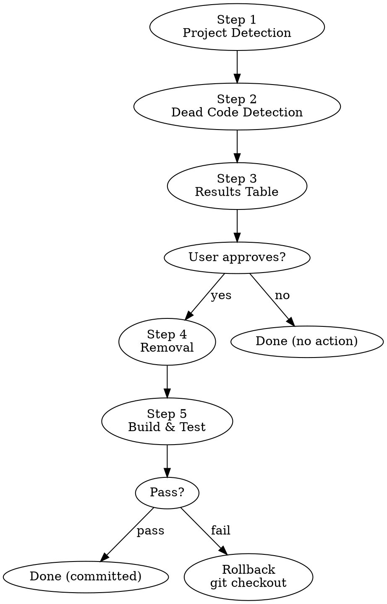

# Dead Code Remover

현재 레포의 미사용 코드를 탐지하고, 사용자 확인 후 안전하게 삭제한 뒤 빌드/테스트로 검증.

## When to Use

- 사용자가 dead code 정리를 직접 요청할 때
- "dead code 정리해줘", "안 쓰는 코드 삭제", "unused code cleanup"
- **자동 트리거 없음** — 항상 수동 호출

## Workflow



### Step 1: 프로젝트 감지

현재 레포의 언어, 프레임워크, 빌드/테스트 도구를 자동으로 파악한다.

확인 대상:
- `package.json`, `tsconfig.json` → TypeScript/JavaScript (NestJS, React, Next.js)
- `go.mod` → Go
- `project.yml`, `*.xcodeproj` → Swift (iOS)
- `build.gradle.kts` → Kotlin (Android)
- `pyproject.toml`, `requirements.txt` → Python
- `Cargo.toml` → Rust

파악할 것:
- **엔트리포인트**: main 파일, app bootstrap, 라우터 등록
- **빌드 명령어**: `npm run build`, `go build`, `xcodebuild build` 등
- **테스트 명령어**: `npm test`, `go test ./...`, `xcodebuild test` 등
- **분석 대상 디렉토리**: `src/`, `app/`, `lib/` 등 (빌드 산출물, vendor 제외)

### Step 2: Dead Code 탐지

분석 대상 디렉토리를 모듈/디렉토리 단위로 나누어 Explore 서브에이전트를 병렬 디스패치한다 (최대 7-8개).

**서브에이전트 프롬프트 템플릿:**

```
조사만 수행. 코드 수정하지 말 것.

[레포명]의 [담당 디렉토리] 내 미사용 코드를 탐지.

프로젝트 정보:
- 언어/프레임워크: [감지 결과]
- 엔트리포인트: [파일 목록]

탐지 대상:
1. 미사용 import/require
2. 미사용 함수/메서드 (선언만 있고 호출 없음)
3. 미사용 클래스/타입/인터페이스
4. 미사용 변수/상수
5. 미사용 export (레포 내 어디에서도 import하지 않는 export)

반드시 보존할 것 (false positive 방지):
- 프레임워크 데코레이터/어노테이션이 붙은 것 (@Controller, @Injectable, @Component 등)
- DI 컨테이너에 등록된 것
- 라우트/엔드포인트 핸들러
- 이벤트 리스너, lifecycle hook
- 테스트 파일 내 코드
- 설정/migration 파일
- public API로 export된 것 (라이브러리인 경우)
- 동적 참조 가능성 (reflect, getattr, dynamic import 등)

경로: [절대 경로]

결과를 JSON으로 정리:
{
  "directory": "담당 디렉토리",
  "findings": [
    {
      "file": "파일 경로",
      "type": "import|function|class|type|variable|export",
      "name": "심볼명",
      "line": 라인번호,
      "confidence": "high|medium",
      "reason": "미사용 판단 근거"
    }
  ]
}

confidence 기준:
- high: 레포 전체에서 참조가 전혀 없음
- medium: 참조가 없으나 동적 사용 가능성 있음
```

### Step 3: 결과 테이블 + 사용자 확인

서브에이전트 결과를 취합하여 테이블로 출력한다.

```markdown
## Dead Code Analysis Results

레포: `meloming-back`
분석 디렉토리: 8개 | 탐지된 dead code: 14건

### 🔴 High Confidence (삭제 안전) — 10건

| # | 파일 | 종류 | 이름 | 라인 | 근거 |
|---|------|------|------|------|------|
| 1 | src/song/song.service.ts | function | `legacyCalculate` | 142 | 레포 내 호출 0건 |
| 2 | src/utils/format.ts | import | `dayjs` | 3 | import 후 미사용 |
| 3 | src/dto/old-response.dto.ts | class | `OldResponseDto` | 1 | 전체 파일 미참조 |
| ... | | | | | |

### 🟡 Medium Confidence (확인 후 삭제) — 4건

| # | 파일 | 종류 | 이름 | 라인 | 근거 |
|---|------|------|------|------|------|
| 1 | src/common/helpers.ts | export | `parseConfig` | 28 | 직접 참조 없으나 동적 로딩 가능성 |
| ... | | | | | |
```

**사용자에게 확인 요청:**

> "High confidence 10건을 삭제할까요? Medium 항목도 포함하시겠습니까?"

**사용자 확인 없이 절대 삭제하지 않는다.**

### Step 4: 삭제 수행

사용자가 승인한 항목만 코드에서 제거한다.

- 미사용 import: 해당 import 문 삭제
- 미사용 함수/클래스/타입: 해당 선언 블록 삭제
- 전체 파일이 dead code인 경우: 파일 삭제
- 삭제 후 빈 줄 정리

### Step 5: 빌드 & 테스트 검증

```bash
# 1. 빌드 실행
[감지된 빌드 명령어]

# 2. 빌드 성공 시 테스트 실행
[감지된 테스트 명령어]
```

**빌드 또는 테스트 실패 시:**
1. 즉시 `git checkout .`으로 롤백
2. 실패 원인 분석 — 어떤 삭제가 문제였는지 식별
3. 문제 항목을 제외하고 나머지만 다시 삭제 제안

**모두 통과 시:**
> "Dead code 삭제 완료. 빌드 ✅ 테스트 ✅. 커밋하시겠습니까?"

## Common Mistakes

- 프레임워크 데코레이터가 붙은 코드를 dead code로 판단하지 말 것 — DI/라우팅에서 사용됨
- 전체 파일 삭제 시 다른 파일에서 해당 파일을 import하는지 반드시 확인
- 테스트 명령어가 없는 레포에서는 빌드 검증만 수행
- 사용자 확인 없이 삭제하지 말 것
- 롤백 시 `git checkout .`만 사용 — `git reset --hard` 사용 금지
