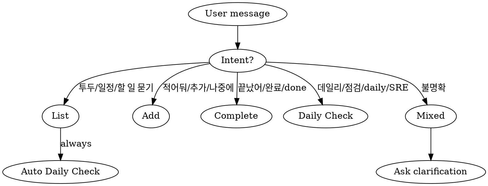
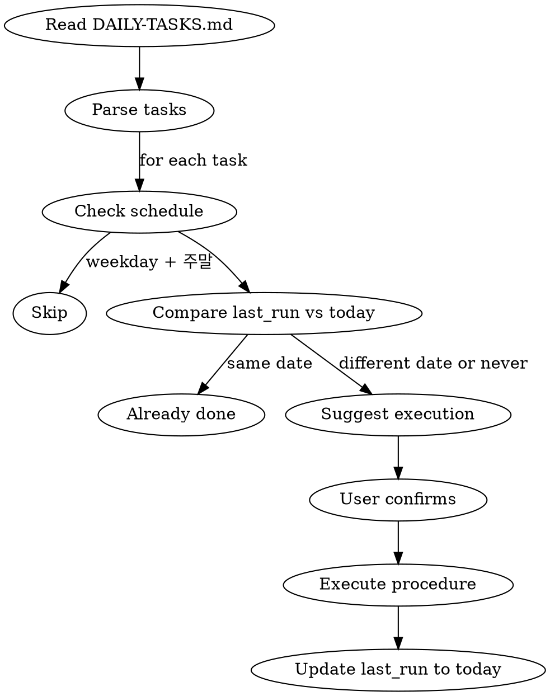

# Memory Todo Manager

MEMORY-TODO.md + project-*.md 기반 투두 관리. 조회/추가/완료 세 가지 동작을 하나의 스킬에서 처리.

## When to Use



## File Conventions

```
memory/
  MEMORY.md              # Rules/references only (auto-loaded)
  MEMORY-TODO.md         # Todo index (skill loads on demand)
  DAILY-TASKS.md         # Daily recurring task definitions + last_run tracking
  project-*.md           # Individual todo details
  archive/               # Completed items
```

**MEMORY-TODO.md format:**
```markdown
# TODO

## YYYY-MM-DD (요일)
- [항목명](project-xxx.md) — 한 줄 요약

## 추후
- [항목명](project-xxx.md) — 한 줄 요약
```

## Category System

Categories: `dev` (개발) | `ops` (운영) | `mkt` (마케팅) | `general` (기타)

### Auto-classification Keywords

| Category | Keywords |
|----------|----------|
| **dev** | 버그, API, 빌드, 배포, 커밋, PR, DB, 코드, Extension, 오버레이, 채팅, 릴레이, ClickHouse, Observability, TypeScript, iOS, Android, 아카이빙, 마이그레이션, PG, 결제, force-end, 세션, 커미션, 인프라 구현 |
| **ops** | 세무, 인건비, GDPR, DLP, WAF, compliance, 배포순서, 보안, 모니터링 설정 |
| **mkt** | 뉴스, 기자, 콘텐츠, 프로모션, 시민기자, 포털 |
| **general** | 위 키워드에 해당하지 않으면 자동으로 기타 |

- Match against item name + description + context
- If uncertain between two categories, ask: "카테고리가 [A] 맞나요, 아니면 [B]?" (max 1 question)
- `category` field goes in project-*.md frontmatter

## Categories

모든 project-*.md의 frontmatter에 `category` 필드 포함. 값: `dev` | `ops` | `mkt` | `general`

### 자동 분류 키워드

| Category | Keywords |
|----------|----------|
| **dev** (개발) | 버그, API, 빌드, 배포, 커밋, PR, DB, 코드, Extension, 오버레이, 채팅, 릴레이, ClickHouse, Observability, TypeScript, iOS, Android, 아카이빙, 마이그레이션, PG, 결제, force-end, 세션, 인증, 쿠키, CORS, 리팩토링, 테스트, CI/CD, Docker, K8s, 쿠버네티스, Terraform, 인프라 코드 |
| **ops** (운영) | 세무, 인건비, GDPR, DLP, WAF, 모니터링, 인프라, compliance, 배포순서, 보안, 감사, 라이선스, 계약, 비용, 결제수단 |
| **mkt** (마케팅) | 뉴스, 기자, 콘텐츠, 프로모션, 시민기자, 포털, 커미션, 작가, 파트너 |
| **general** (기타) | 위 키워드에 해당하지 않는 항목 |

- 이름 + 설명 기반으로 자동 분류
- **불확실하면 사용자에게 물어봄** (max 1 question, choices: 개발/운영/마케팅/기타)
- 확실하면 묻지 않음

## Core Operations

### 1. List (조회)

1. Read `MEMORY-TODO.md` → parse date sections
2. Read each referenced `project-*.md` → extract status/remaining work + category
3. Sort: 오늘 → 기한 초과 → 내일 → 이번 주 → 추후
4. Output grouped by date with counts
5. 기한 초과 항목은 **기한 초과** 강조 표시
6. **카테고리 필터 지원**: "개발 투두", "운영 일정", "마케팅 할 일" 등 카테고리 언급 시 해당 항목만 표시. Category names: 개발=dev, 운영=ops, 마케팅=mkt, 기타=general
7. **Daily Task 자동 체크**: 투두 목록 출력 후 DAILY-TASKS.md도 체크하여 미실행 daily task 표시 (상세: Daily Tasks 섹션 참조)

### 2. Add (추가)

1. Extract from natural language: name, description, deadline
2. **Default deadline = 오늘 + 7일** (deadline not specified → auto-assign, don't ask)
3. Only ask about deadline when context suggests urgency matters:
   - User explicitly mentioned urgency ("급해", "빠르게", "ASAP")
   - Task is clearly time-sensitive (bug fix, incident response)
   - Task relates to an external deadline (partner delivery, compliance date)
4. Vague description → "구체적으로 어떤 작업인가요?" (max 1 question total)
5. Duplicate check: scan MEMORY-TODO.md for similar names, warn if found
6. **Auto-classify category** using keywords above → write `category` in frontmatter
7. Create `project-{kebab-case-name}.md` with frontmatter (includes `category`)
8. Add one-line entry to MEMORY-TODO.md in correct date section
9. Create date section if needed: `## YYYY-MM-DD (요일)`
10. **`## 추후` is only for items where user explicitly says "급하지 않아" or "나중에"**

### 3. Complete (완료)

1. Identify target from natural language or conversation context
2. If unclear → show candidate list, ask to select
3. Remove entry from MEMORY-TODO.md
4. Move `project-*.md` → `archive/project-*.md` (create archive/ if needed)
5. **Do NOT modify MEMORY.md**

## Common Mistakes

- Don't add todos to MEMORY.md — use MEMORY-TODO.md
- Don't delete project files on completion — move to archive/
- Don't ask more than 2 questions when adding
- Don't skip duplicate check before adding
- Default deadline = 오늘 + 7일. "추후"는 사용자가 명시적으로 "나중에"/"급하지 않아"라고 할 때만
- Daily task 완료 후 last_run 업데이트 잊지 말 것
- Daily task를 MEMORY-TODO.md에 추가하지 말 것 — DAILY-TASKS.md에서 별도 관리

---

## Daily Tasks (데일리 태스크)

매일 반복 수행하는 작업 관리. DAILY-TASKS.md에 정의된 작업의 `last_run`을 오늘 날짜와 비교하여 미실행 작업을 감지하고 실행을 제안.

### DAILY-TASKS.md Format

```markdown
# Daily Tasks

## {Task Name}
- **last_run**: YYYY-MM-DD 또는 never
- **schedule**: daily | weekday
- **category**: dev | ops | mkt | general

### Procedure
1. Step 1 — 구체적 실행 절차
2. Step 2
...
```

- `last_run`: 마지막 실행 날짜. `never`면 한 번도 실행 안 한 것
- `schedule`: `daily`(매일) 또는 `weekday`(평일만, 토/일 건너뜀)
- `category`: 투두와 동일한 카테고리 시스템
- `Procedure`: 실행할 구체적 절차. 다른 스킬(dylabs-devops 등) 참조 가능

### Operation: Daily Check (데일리 체크)

**Trigger**: "데일리", "daily check", "점검", "오늘 점검", "SRE", "시스템 점검" 또는 List 조회 시 자동



**상세 절차:**

1. **DAILY-TASKS.md 읽기** — 파일 없으면 건너뜀 (에러 아님)
2. **각 태스크 파싱** — `## {name}`, `last_run`, `schedule`, `category`, `Procedure`
3. **스케줄 체크**
   - `weekday`: 오늘이 토/일이면 건너뜀
   - `daily`: 항상 실행 대상
4. **last_run vs 오늘 비교**
   - `last_run` == 오늘 → 이미 완료, 건너뜀
   - `last_run` < 오늘 또는 `never` → 미실행, 제안
5. **미실행 태스크 표시**
   ```
   ⏰ 오늘 미실행 Daily Task:
   - [ ] {Task Name} (마지막 실행: {last_run})
   ```
6. **사용자가 실행 확인하면** → Procedure 절차 순서대로 실행
7. **완료 후** → DAILY-TASKS.md의 `last_run`을 오늘 날짜(YYYY-MM-DD)로 업데이트

### Auto-suggest on List

**List(조회) 동작 시 Daily Task 체크를 자동 수행:**

1. 일반 투두 목록 출력
2. DAILY-TASKS.md 체크
3. 미실행 daily task가 있으면 투두 목록 하단에 별도 섹션으로 표시:
   ```
   ---
   ⏰ 미실행 Daily Tasks:
   - [ ] SRE Daily Health Check (마지막: 2026-04-09)
   ```
4. 사용자가 실행을 원하면 procedure 수행 → last_run 업데이트

### Adding / Removing Daily Tasks

**추가**: 사용자가 "매일 {task} 해줘", "데일리 태스크 추가" 등 요청 시
1. DAILY-TASKS.md에 새 섹션 추가 (format 준수)
2. `last_run: never`, 적절한 `schedule`과 `category` 설정
3. Procedure는 사용자 설명 기반으로 구체적으로 작성

**제거**: 사용자가 "데일리 {task} 삭제", "더 이상 안 해도 돼" 등 요청 시
1. DAILY-TASKS.md에서 해당 섹션 전체 삭제

**수정**: Procedure나 schedule 변경 요청 시 해당 필드만 업데이트

## First-Time Initialization

If MEMORY-TODO.md doesn't exist:
1. Scan MEMORY.md for sections containing `DEADLINE: YYYY-MM-DD` or Korean dates (`4/3`, `4/5`)
2. Extract project-*.md links from those sections
3. Generate MEMORY-TODO.md with proper date grouping
4. Remove those sections from MEMORY.md (keep rules/references/feedback)
