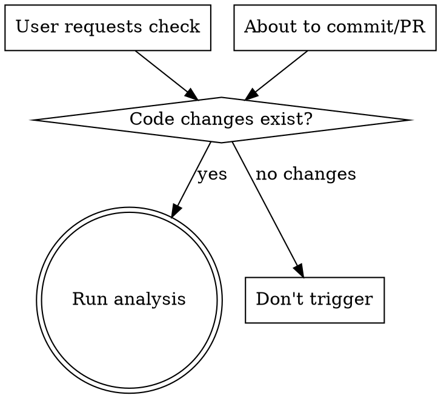

# Side Effect Analyzer

코드 변경의 크로스 레포 사이드이펙트를 체계적으로 탐지. 변경된 심볼을 전체 레포에서 grep한 뒤, hit가 있는 레포별로 서브에이전트가 실제 영향을 분석.

## When to Use



- 개발 작업 완료 후 "사이드이펙트 점검해줘"
- 커밋/PR 생성 직전 자동 제안: "변경사항에 대해 사이드이펙트 점검을 먼저 하시겠습니까?"
- 코드 수정 없음 — **읽기 전용 조사만 수행**

## Workflow

### Step 1: 변경 심볼 추출

현재 레포의 변경 범위를 파악하고 핵심 심볼을 추출한다.

```bash
# 변경 범위 파악 (3가지 소스 모두 확인)
git diff                          # unstaged changes
git diff --cached                 # staged changes
git log origin/main..HEAD --diff-stat  # committed but not pushed
```

변경된 코드에서 다음 심볼들을 식별:
- API 엔드포인트 경로
- 함수/메서드명
- DTO, 타입, 인터페이스명
- DB 테이블/컬럼명
- 환경변수, 설정 키
- import 경로, 패키지명

**심볼 추출은 에이전트가 diff를 읽고 판단한다.** 기계적 파싱이 아니라, 변경의 의미를 이해하고 "다른 곳에서 참조할 가능성이 있는 것"을 골라낸다.

### Step 2: 전체 레포 grep 스캔

추출된 심볼을 워크스페이스 전체에서 검색한다.

**검색 대상**: 워크스페이스 루트 하위 모든 레포 (현재 작업 중인 레포 제외)

**제외 디렉토리**: `node_modules`, `.git`, `build`, `dist`, `.next`, `Pods`, `.gradle`, `DerivedData`, `.turbo`, `.cache`

**제외 파일**: `*.lock`, `*.map`, `*.min.js`, 바이너리

결과: 심볼별로 hit가 있는 레포/파일 목록.

### Step 3: 서브에이전트 디스패치

hit가 있는 레포별로 Explore 서브에이전트를 병렬 실행한다 (최대 7-8개).

**서브에이전트 프롬프트 템플릿:**

```
조사만 수행. 코드 수정하지 말 것.

[현재 레포]에서 다음 변경이 발생했다:
[변경 요약 — 어떤 심볼이 어떻게 바뀌었는지]

[대상 레포]에서 아래 파일들이 해당 심볼을 참조하고 있다:
[grep 결과 — 파일:라인 목록]

조사할 것:
1. 각 참조가 실제 의존인지 확인 (import, 호출, 타입 사용 vs 단순 주석/문서)
2. 변경으로 인해 깨질 수 있는 코드가 있는지 분석
3. 업스트림 영향 (이 코드가 의존하는 것이 바뀜)
4. 다운스트림 영향 (이 코드에 의존하는 것이 영향받음)
5. 위험도 판단:
   - 🔴 높음: 빌드 실패, 런타임 에러, 데이터 불일치 가능
   - 🟡 중간: 동작은 하지만 의도와 다를 수 있음
   - 🟢 낮음: 영향 가능성 있으나 실질적 문제 없음

경로: [대상 레포 절대 경로]

결과를 JSON으로 정리:
{
  "repo": "레포명",
  "findings": [
    {
      "file": "파일 경로",
      "risk": "높음|중간|낮음",
      "action_needed": true|false,
      "detail": "구체적 영향 설명"
    }
  ]
}
```

### Step 4: 결과 집계 및 출력

서브에이전트 결과를 취합하여 위험도 순으로 정렬한 테이블을 출력한다.

```markdown
## Side Effect Analysis Results

변경 레포: `meloming-back`
분석된 심볼: `SongResponseDto`, `/api/v1/songs`, `calculatePrice`, ...
스캔된 레포: 12개 | hit 레포: 4개

| # | 서비스/레포 | 영향받는 파일 | 위험도 | 조치 필요 | 상세 |
|---|------------|-------------|--------|---------|------|
| 1 | meloming-front | src/api/song.ts | 🔴 높음 | 수정 필요 | API 응답 필드 변경으로 타입 불일치 |
| 2 | meloming-ios | Sources/API/SongAPI.swift | 🔴 높음 | 수정 필요 | DTO 필드 누락 |
| 3 | meloming-android | data/api/SongApi.kt | 🔴 높음 | 수정 필요 | 동일 DTO 사용 중 |
| 4 | meloming-admin | pages/songs/index.tsx | 🟡 중간 | 확인 필요 | 동일 엔드포인트 사용 |
| 5 | deploy-gitops | apps/back/values.yaml | 🟢 낮음 | 불필요 | 환경변수 참조만 |

### 🔴 즉시 조치 필요 (3건)
- **meloming-front**: `SongResponseDto`의 `price` 필드가 제거됨. `src/api/song.ts:42`에서 직접 참조 중
- **meloming-ios**: `SongResponse.price` 사용 중. 빌드 실패 예상
- **meloming-android**: `SongResponseDto.price` 매핑 중. 컴파일 에러 예상

### 🟡 확인 필요 (1건)
- **meloming-admin**: `/api/v1/songs` 호출 중. 응답 구조 변경 시 화면 깨짐 가능

### 🟢 영향 없음 (1건)
- **deploy-gitops**: 환경변수 참조만. 코드 변경과 무관
```

hit가 전혀 없으면:
```markdown
## Side Effect Analysis Results

변경 레포: `meloming-back`
스캔된 레포: 12개 | hit 레포: 0개

✅ 크로스 레포 사이드이펙트가 발견되지 않았습니다.
```

## 자동 제안 트리거

커밋 또는 PR 생성 요청 시, 아직 사이드이펙트 점검을 하지 않았다면:

> "이 변경사항에 대해 크로스 레포 사이드이펙트 점검을 먼저 하시겠습니까? (`/side-effect-analyzer`)"

사용자가 거부하면 바로 커밋/PR 진행.

## Common Mistakes

- 현재 작업 중인 레포를 grep 대상에 포함하지 말 것 — 자기 자신의 변경은 이미 알고 있다
- 서브에이전트를 8개 초과 띄우지 말 것 — 같은 조직의 레포는 묶어서 하나의 에이전트에 위임
- grep hit가 있다고 무조건 위험으로 판단하지 말 것 — 주석, 문서, 테스트 내 언급은 서브에이전트가 걸러야 한다
- 코드를 수정하지 말 것 — 이 스킬은 읽기 전용 조사만 수행
