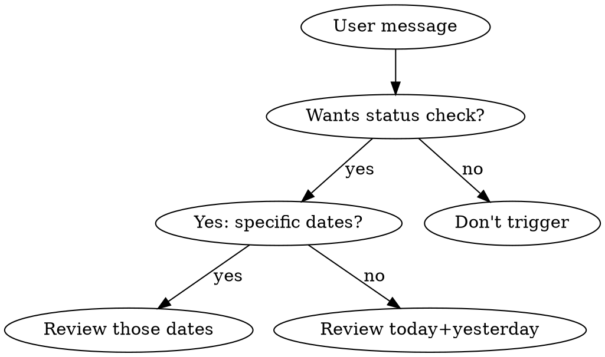

# Todo Review

MEMORY-TODO 항목의 실제 구현 상태를 Sub Agent 병렬 조사로 확인. 완료/진행중/미시작 분류 + 투두 정리 권고.

## When to Use



- User asks about todo progress or implementation status
- User wants to clean up stale todo items
- User says "어디까지 됐어", "상태 확인", "투두 리뷰"
- Do NOT trigger for simple todo list/add/complete (use memory-todo)

## Workflow

### Step 1: Load Todo Items

1. Read `MEMORY-TODO.md` from the project memory directory
2. Parse date sections → extract all items with project-*.md links
3. **Scope determination:**
   - User specified dates (e.g., "어제오늘", "4/3 것만") → filter to those dates
   - No specification → default to **today + yesterday**
   - "전체" or "all" → review all items
4. Read each referenced `project-*.md` → extract: name, description, repository paths, key files, remaining tasks

### Step 2: Dispatch Sub Agents

Launch one Explore sub-agent per item in parallel (max 7-8 concurrent).

**Sub-agent prompt template:**
```
조사만 수행. 코드 수정하지 말 것.

[항목명]의 현재 구현 상태를 확인.

[project-*.md에서 추출한 컨텍스트 — 키워드, 파일 경로, 체크리스트 등]

확인 사항:
1. 관련 파일 존재 여부 및 최근 수정 내역
2. `git log --oneline -10`으로 관련 커밋
3. `git status`로 미커밋 변경사항
4. [항목별 특정 체크포인트]

경로: [관련 리포 경로들]

결과를 정리: [완료/진행중/미시작] + 근거
```

**Context extraction per item:**
- From project-*.md frontmatter: name, description, category
- From body: 구현 순서, 체크리스트, 수정 파일 목록, 다음 단계
- Map keywords to likely repositories:
  - `meloming-chat-service`, `meloming-back`, `meloming-overlay`, `meloming-front` → `/Users/hyeonwoo/DEV/{repo}`
  - `terraform-main`, `monitoring-gitops` → `/Users/hyeonwoo/DEV/{repo}`
  - `commission-back` → `/Users/hyeonwoo/DEV/meloming-commission-back`
  - Check `ls /Users/hyeonwoo/DEV/ | grep` if path unclear

### Step 3: Aggregate & Present

Collect all sub-agent results. Present summary table:

```markdown
## [날짜] — N개 항목

| # | 항목 | 상태 | 판단 |
|---|------|------|------|
| 1 | 항목명 | ✅ 완료 | **삭제 가능** |
| 2 | 항목명 | ⚠️ 진행중 | **유지** |
| 3 | 항목명 | ❌ 미시작 | **유지** |
```

**Status classification:**
- ✅ 완료: All code committed, tests passing, deployed (or deploy-ready)
- ⚠️ 진행중: Partial implementation, uncommitted changes, tests pending
- ❌ 미시작: No relevant code changes found

**Recommendation rules:**
- ✅ 완료 → "삭제 가능" (ask user to confirm removal)
- ⚠️ 진행중 → "유지" + next steps description
- ❌ 미시작 → "유지" (keep in todo, may need deadline adjustment)

### Step 4: Cleanup Offer

After presenting results, ask: "완료된 항목들을 투두에서 삭제할까요?"

If yes → use memory-todo Complete operation for each ✅ item (remove from MEMORY-TODO.md, move project-*.md to archive/).

## Common Mistakes

- Don't dispatch too many agents (>8). Group items sharing the same repo if needed.
- Don't modify any code. This skill is read-only investigation.
- Don't skip reading project-*.md before dispatching agents — context is needed for targeted investigation.
- Don't automatically delete completed items. Always ask user first.
