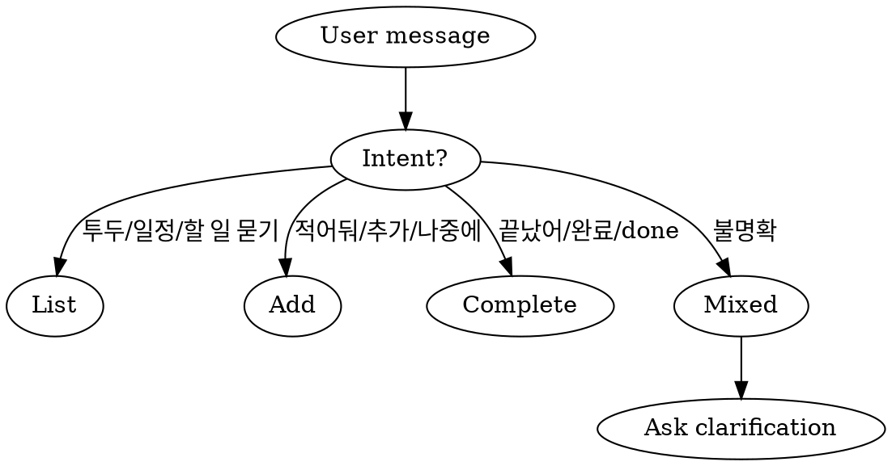

# Memory Todo Manager

MEMORY-TODO.md + project-*.md 기반 투두 관리. 조회/추가/완료 세 가지 동작을 하나의 스킬에서 처리.

## When to Use



## File Conventions

```
memory/
  MEMORY.md              # Rules/references only (auto-loaded)
  MEMORY-TODO.md         # Todo index (skill loads on demand)
  project-*.md           # Individual todo details
  archive/               # Completed items
```

**MEMORY-TODO.md format:**
```markdown
# TODO

## YYYY-MM-DD (요일)
- [항목명](project-xxx.md) — 한 줄 요약

## 추후
- [항목명](project-xxx.md) — 한 줄 요약
```

## Core Operations

### 1. List (조회)

1. Read `MEMORY-TODO.md` → parse date sections
2. Read each referenced `project-*.md` → extract status/remaining work
3. Sort: 오늘 → 기한 초과 → 내일 → 이번 주 → 추후
4. Output grouped by date with counts
5. 기한 초과 항목은 **기한 초과** 강조 표시

### 2. Add (추가)

1. Extract from natural language: name, description, deadline
2. **Default deadline = 오늘 + 7일** (deadline not specified → auto-assign, don't ask)
3. Only ask about deadline when context suggests urgency matters:
   - User explicitly mentioned urgency ("급해", "빠르게", "ASAP")
   - Task is clearly time-sensitive (bug fix, incident response)
   - Task relates to an external deadline (partner delivery, compliance date)
4. Vague description → "구체적으로 어떤 작업인가요?" (max 1 question total)
5. Duplicate check: scan MEMORY-TODO.md for similar names, warn if found
6. Create `project-{kebab-case-name}.md` with frontmatter
7. Add one-line entry to MEMORY-TODO.md in correct date section
8. Create date section if needed: `## YYYY-MM-DD (요일)`
9. **`## 추후` is only for items where user explicitly says "급하지 않아" or "나중에"**

### 3. Complete (완료)

1. Identify target from natural language or conversation context
2. If unclear → show candidate list, ask to select
3. Remove entry from MEMORY-TODO.md
4. Move `project-*.md` → `archive/project-*.md` (create archive/ if needed)
5. **Do NOT modify MEMORY.md**

## Common Mistakes

- Don't add todos to MEMORY.md — use MEMORY-TODO.md
- Don't delete project files on completion — move to archive/
- Don't ask more than 2 questions when adding
- Don't skip duplicate check before adding
- Default deadline = 오늘 + 7일. "추후"는 사용자가 명시적으로 "나중에"/"급하지 않아"라고 할 때만

## First-Time Initialization

If MEMORY-TODO.md doesn't exist:
1. Scan MEMORY.md for sections containing `DEADLINE: YYYY-MM-DD` or Korean dates (`4/3`, `4/5`)
2. Extract project-*.md links from those sections
3. Generate MEMORY-TODO.md with proper date grouping
4. Remove those sections from MEMORY.md (keep rules/references/feedback)
